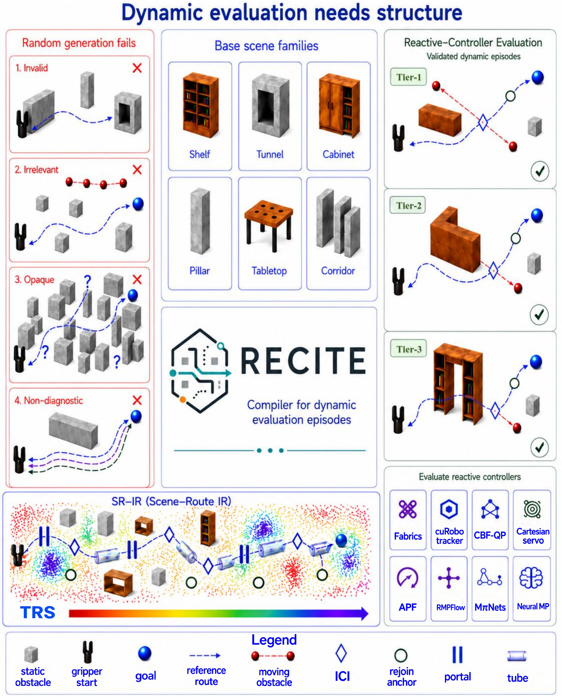
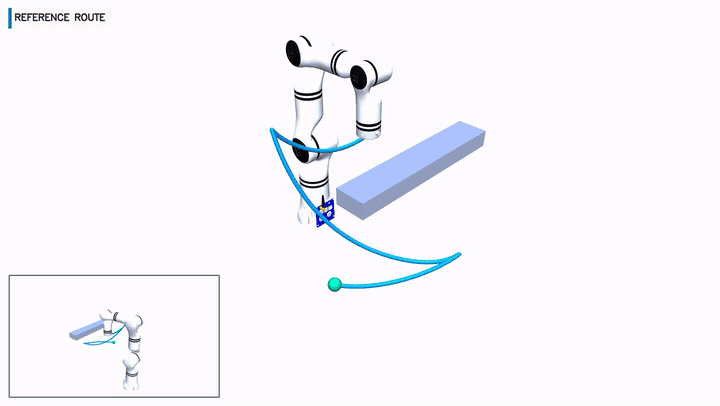
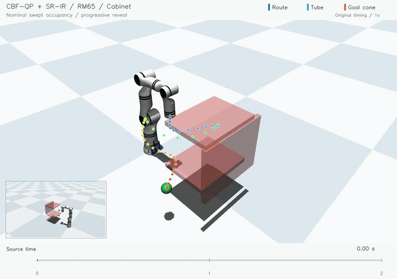

<div align="center">

<h1>RECITE</h1>

**A Reactive-Evaluation Compiler with Scene–Route Intermediate Representation for Topology-Aware Dynamic Episodes**

*From static scene–route pairs to structured dynamic evaluation.*


[](LICENSE)

</div>

[Overview](#overview) · [Conceptual overview](#conceptual-overview) · [Examples](#visual-examples) · [Quick start](#quick-start) · [Release roadmap](#release-roadmap)

## Overview

RECITE turns static scene–route pairs into structured dynamic evaluation tasks for reactive manipulators. Its **Scene–Route Intermediate Representation (SR–IR)** connects the reference route, swept occupancy, local clearance, interaction-candidate intervals (ICIs), portals, recovery candidates, and goal approach geometry. These fields support where and when to introduce moving obstacles, and provide context for downstream controller adapters.

This initial release provides static scene generation, SR–IR construction, route-conditioned dynamic proposals, and contact diagnostics, with a runnable RM65 example and measured stage summaries. **The complete version will be organized and released over the next few months.**

### What RECITE brings together

- **Structured scenes:** expand geometric templates while preserving scene-family structure.
- **Route-aware dynamic events:** use SR–IR to place and time moving obstacles around a reference motion.
- **Inspectable evaluation:** retain geometry, interaction context, and contact diagnostics alongside each case.

## Conceptual overview

<p align="center">
  
</p>

The manuscript's Figure 1 presents RECITE's overall concept: structured scene families and SR–IR support validated dynamic episodes across three structural tiers and matched reactive-controller evaluation. The released numerical kernels and CPU example cover scene generation, route representation, and dynamic proposals; the roadmap extends these stages with integrated planning and controller adapters.

## Visual examples

<table>
  <tr>
    <th width="50%">Scene–Route IR</th>
    <th width="50%">Dynamic obstacle avoidance</th>
  </tr>
  <tr>
    <td></td>
    <td></td>
  </tr>
  <tr>
    <td>Reference-route structure and its field-level interpretation.</td>
    <td>Obstacle interaction, continuous avoidance, and recovery toward the goal.</td>
  </tr>
</table>

The animations are qualitative illustrations. In the avoidance example, tube opacity follows local route progress to keep the motion visible; the underlying nominal swept occupancy is unchanged. [SR–IR figure with legend](assets/srir_fields.png) · [Media sources and roles](assets/README.md).

## Included in this release

| Component | Contents |
|---|---|
| Static scene generation | 25 geometric templates, perturbations, and the original geometry-validity screen |
| SR–IR construction | Clearance profiles, full-body occupied tube, ICIs, portals, static rejoin candidates, and goal approach cone |
| Dynamic proposals | Route-conditioned sphere-motion primitives and ICI-conditioned crossing placement |
| TRS kernels | Voxel-density construction, route queries, and the existing reachability-score implementation |
| Contact diagnostics | Sphere–box clearance, dynamic penetration depth, first-contact link, and relative normal approach speed |
| Recorded example | 153 reference-route samples with the RM65 11-sphere geometry and recorded sphere centers |
| Stage results | Static generation over 10,000 requested slots and a four-strategy dynamic-proposal batch |

The numerical kernels are extracted from the existing project implementation; [SOURCE_MAP.json](SOURCE_MAP.json) identifies their original modules. **The runnable example runs on CPU with Python and NumPy.**

## Quick start

```bash
git clone https://github.com/Lhy-code/RECITE.git
cd RECITE
python3 -m venv .venv
source .venv/bin/activate
python -m pip install -r requirements.txt
OPENBLAS_NUM_THREADS=1 OMP_NUM_THREADS=1 python examples/compile_sample.py --output outputs/sample
```

The example:

1. Checks the 25 static templates and generates three static variants.
2. Loads an independently recorded reference route and its sphere-center traces.
3. Recomputes clearance and SR–IR fields from that recorded scene–route pair.
4. Places a moving sphere using an ICI and measures its interaction with nominal motion.

The example covers two compiler stages: static sampling produces new scene variants, and route compilation uses the recorded route with its original scene geometry. Subsequent releases will connect these stages through reference-route planning, controller execution, C-space sampling, and `G_solve` certification.

### Outputs

```text
outputs/sample/
├── static_variants.json    # Three sampled static scenes
├── compiled_srir.json      # Fields rebuilt from the recorded scene–route pair
├── dynamic_proposal.npz    # Sphere positions, activation mask, radius, and time
└── summary.json            # Stage counts, clearances, and contact diagnostics
```

For the supplied example, the run reconstructs **3 ICIs, 1 portal, and 3 static rejoin candidates**. The moving obstacle starts clear of the robot and then intersects nominal motion. This demonstrates a dynamic-interaction proposal; constructive solvability is checked separately by `G_solve` in the complete pipeline.

Run the small CPU checks with:

```bash
OPENBLAS_NUM_THREADS=1 OMP_NUM_THREADS=1 python -m unittest discover -s tests -v
```

## Representation and units

- Geometry uses metres; timestamps use seconds. The included trace uses a 60 Hz timebase.
- ICI indices are `[start, end)` intervals of the nominal reference route. The original function name `find_event_windows` is retained; its public-facing field is `interaction_candidate_intervals`.
- The occupied tube captures full-body occupancy using all recorded robot-sphere centers and radii.
- The released rejoin kernel selects statically clear points after ICIs. Online bridge generation and dynamic candidate ranking are part of the controller adapters to be organized next.
- TRS kernels compute density and reachability scores from caller-supplied collision-free configuration samples. The CPU example compiles route geometry; its TRS metadata identifies the C-space samples needed to evaluate this additional field.
- Contact diagnostics report geometric penetration depth and relative normal approach speed, in metres and metres per second.

## Measured stage snapshots

The following files preserve the measurement scope and original denominators:

| Snapshot | Measurement |
|---|---|
| [Static generation](results/static_stage_10000_slots.json), 2026-08-05 | 9,744 valid variants from 10,000 requested output slots; all 25 parent templates represented |
| [Dynamic proposals](results/dynamic_proposals_4x2500.json), 2026-08-07 | Uniform, Route-near, Route-time, and RECITE; 2,500 selected attempts per strategy |

The dynamic snapshot reports proposal filtering and fixed-route scheduling (`G_schedule`) counts with explicit batch definitions. The expanded benchmark and reproduction instructions are scheduled for the complete release.

## Repository structure

```text
RECITE/
├── assets/                 # README figures and short qualitative animations
├── recite/                 # Scene, SR–IR, proposal, TRS, and metric kernels
├── examples/               # Runnable CPU stage example
├── data/                   # Recorded RM65 scene–route sample
├── results/                # Measured stage summaries
├── tests/                  # Small numerical and sample checks
├── SOURCE_MAP.json         # Original implementation locations
└── requirements.txt
```

## Release roadmap

- [x] Static scene templates and geometry rules
- [x] Numerical SR–IR, dynamic-proposal, and diagnostic kernels
- [x] Recorded scene–route example and measured stage summaries
- [ ] Integrated reference-route planning and `G_solve` workflow
- [ ] Controller adapters and matched evaluation configuration
- [ ] Expanded benchmark episodes and organized reproduction instructions

The complete version will bring together the research pipeline, benchmark episodes, and reproduction instructions over the next few months. The figures and GIFs provide a visual introduction to the method alongside the released code.

## Citation

```bibtex
@misc{recite_code2026,
  author = {RECITE contributors},
  title = {RECITE: A Reactive-Evaluation Compiler with Scene--Route Intermediate Representation for Topology-Aware Dynamic Episodes},
  year = {2026},
  howpublished = {\url{https://github.com/Lhy-code/RECITE}}
}
```

## License and acknowledgments

The original RECITE implementation is released under the [MIT License](LICENSE). The adapted cuRobo scene configurations retain their [NVIDIA License](LICENSES/curobo.txt), including its research/evaluation use terms. Scene provenance labels identify the RM65, MoveIt-style geometric, and cuRobo families. See [THIRD_PARTY_NOTICES.md](THIRD_PARTY_NOTICES.md) for attribution. Third-party planners, controller implementations, checkpoints, and robot assets are distributed through their respective upstream projects.
